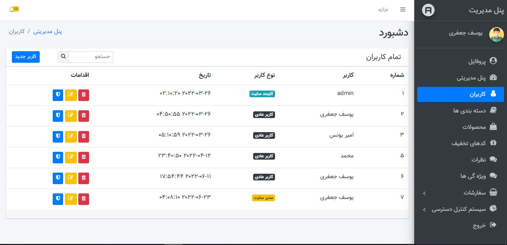

# laravel shop

## سلام رفیق ، این یه فروشگاه اینترنتی خیلی خفنه که با استفاده از لاراول به وجود اومده

## ویژه گی های این فروشگاه
    

- دارای سیستم احراز حویت 2 مرحله با کد 6 رقمی

- دارای صفحه ثبت محصول پیشرفته با قابلیت اضافه متغیر ها
    

- 2 درگاه پرداهت زرین پال و پی پینگ
    

- سیستم مدیریت سفارشات
   

- سیستم کنترل دتسرسی با قابلیت تعیین مقام برای کاربر های کارمند برای محدود سازی دسترسی ها با بیش از 30 دسترسی متفاوت
   

- سید خرید ساخته شده توسط سسشن ها در لاراول
 

- ورود با گوگل
 

## از چه چیز هایی استفاده کردم؟
    laravel v-8
    tailwind css v-3
    html 
    css 
    java script
    
## تصاویر

    
    
    
    
    
    
    
    

